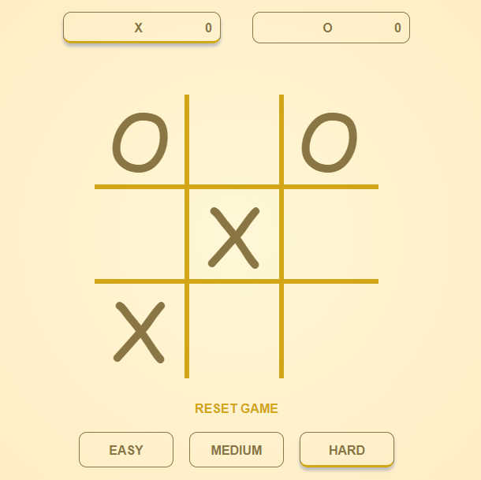

# Tic Tac Toe ⁣⭕❌
A simple Tic Tac Toe game against computer with 3 modes of difficulties i.e. **Easy, Medium and Hard**.


## Screenshot 📸



  
## Installation 🔰

```bash 
  git clone https://github.com/Sahethi/tic-tac-toe.git
```
    
## FAQ

#### How to Play? ✨

* Steps
    * Select **X or O**.
    * Select the difficulty level i.e. **Easy, Medium or Hard**.
    * Click on **Start Game** and enjoy playing.
    * Once done playing, click on **Reset Game** or the game will reset by itself.
 
## Tech Stack 💻

**Used:** JavaScript, CSS, HTML

  
## Authors 👩‍💻

- [@Sahethi](https://www.github.com/Sahethi)

  
## Support 🙌

Don't forget to give this Repository a ⭐!

  
